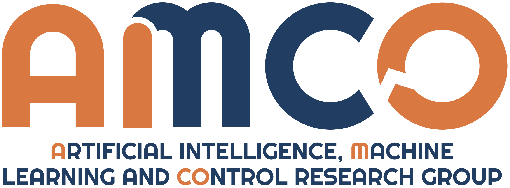

# A Fairness-Oriented Multi-Objective Reinforcement Learning approach for Autonomous Intersection Management
## Matteo Cederle, Marco Fabris and Gian Antonio Susto
#### Department of Information Engineering, University of Padova, 35131 Padua via Gradenigo 6/B, Italy
#### Paper submitted to [J3C 2025](https://j3c.org/)



### Abstract
This study introduces a novel multi-objective reinforcement learning (MORL) approach for autonomous intersection management, aiming to balance traffic efficiency and environmental sustainability across electric and internal combustion vehicles. The proposed method utilizes MORL to identify Pareto-optimal policies, with a post-hoc fairness criterion guiding the selection of the final policy. Simulation results in a complex intersection scenario demonstrate the approach's effectiveness in optimizing traffic efficiency and emissions reduction while ensuring fairness across vehicle categories. We believe that this criterion can lay the foundation for ensuring equitable service, while fostering safe, efficient, and sustainable practices in smart urban mobility.

## How to train and evaluate the algorithm
1. Clone the repository
2. [Set up FLOW](https://flow.readthedocs.io/en/latest/)

   [FLOW repository](https://github.com/flow-project/flow), [FLOW paper](https://arxiv.org/abs/1710.05465)
3. Train the RL agents: 
   ```
   # You can optionally set the seed by adding --seed x, where x is the chosen seed (default 0)
   python main.py --save_model
   ```
5. After the agents have been trained you can evaluate the results:
   ```
   # You can optionally set the seed by adding --seed x, where x is the chosen seed (default 0)
   python evaluation.py
   ```
6. To plot the results, use the file plots.py

## Cite this work
If you find our work interesting for your research, please cite the [paper](). In BibTeX format:

```bibtex

```